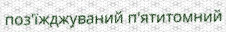

# Ukrainian-OCR-Dataset

20k test images
180k train images

Generated from combinations of Ukrainian letters, numbers and other symbols.
Used open-source word dictionary.
Unfiltered data.

## Examples

